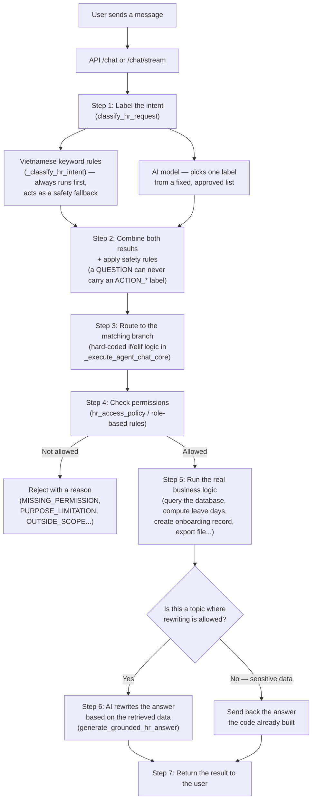

# Report: How the HR Agent Works

**Date:** 2026-09-04
**Scope:** The full path of a chat message sent to the `HR` AI Agent, from the moment it arrives to the moment it gets answered.
**Related code:**
- [agent_executor.py](../backend/app/services/agents/agent_executor.py) — the main router and executor
- [hr_llm_flow.py](../backend/app/services/agents/hr_llm_flow.py) — the LLM calls (intent labeling, field extraction, answer writing)
- [hr_access_policy.py](../backend/app/services/hr_access_policy.py) — the engine that controls access to HR data
- [chat.py](../backend/app/api/v1/chat.py) — the `/chat` and `/chat/stream` API endpoints

---

## 1. The one-sentence version

The HR Agent handles every message with a simple split of jobs: **the AI model only picks a label, the plain code decides what to do**. The AI is allowed to choose one intent label from a fixed, pre-approved list — nothing more. All the actual database lookups, permission checks, and answer-building are done by hard-coded logic. The AI can never call a tool on its own or decide by itself which employee's data gets shown.

---

## 2. Overall flow diagram

---

## 3. Step-by-step explanation

### Steps 1–2: Figuring out what the user wants

Every message is classified through **two parallel checks**, so the system is never fully dependent on the AI model:

1. **A fixed Vietnamese keyword matcher** (`_classify_hr_intent`) — looks for phrases like "how many leave days left," "export the list," "full profile"... and assigns an intent label from that. This is the **always-available backup**, and it still works even if the external AI service is down or fails.
2. **An AI router** (`classify_hr_request`) — sends the raw message to the language model and asks for exactly two fields back: `kind` (QUESTION or ACTION) and `intent` (one of 17 fixed labels, such as `QUERY_LEAVE_BALANCE`, `FULL_PROFILE`, `POLICY_QUERY`, and so on). Any label the model returns that isn't on the approved list is thrown away — no exceptions.

The two results are then merged using safety-first rules:
- If the AI says the message is a **question** (QUESTION) but tags it with an action label (ACTION_*), the system overrides that back to `POLICY_QUERY`. This **stops a question from accidentally triggering a real action** — asking "how do I request leave" must never itself create a leave request.
- If the AI says it's an **action** (ACTION) but the label isn't one of the 3 defined actions (`ACTION_EXPORT`, `ACTION_LEAVE_REQUEST`, `ACTION_ONBOARDING`), the system blocks it as `UNKNOWN` instead of guessing what to run.
- A follow-up message continuing an unfinished leave request (adding a date, a reason) is detected separately, so multi-turn conversations keep their context.

### Step 3: Routing (dispatch)

The final intent label is fed into a chain of `if/elif` branches that are **hard-coded** (`_execute_agent_chat_core`). Each branch matches exactly one pre-built business function: view a full profile, view your own salary, look up the employee/manager directory, count who's on leave, create a leave request, export a file, start onboarding, and so on. **The AI cannot invent a new capability or pick a tool on its own** — it only ever picks a label, and which piece of code that label leads to is fixed in advance.

### Step 4: Controlling access to HR data

Before any personal data is returned, the system runs 4 layers of checks at once (`hr_access_policy.py`):

| Check layer | What it verifies |
|---|---|
| **Tenant** | The requester and the target employee must belong to the same company (workspace) |
| **Scope** | Viewing yourself → always allowed; viewing someone else → you need company-wide HR access, or that person must be in your direct management chain |
| **Role-based permissions (RBAC)** | The requester's position must have permission to read each specific data section (basic info, private info, contract, salary, performance, discipline, HR notes, documents) |
| **Purpose limitation** | Each declared purpose (contract renewal, performance review, onboarding, payroll processing...) only unlocks the data sections that purpose actually needs — even someone with general salary access still gets salary blocked if the stated purpose is "contract renewal" |

Any data section that doesn't clear all 4 layers is refused with a specific reason (e.g. `MISSING_PERMISSION`, `PURPOSE_LIMITATION`, `OUTSIDE_SCOPE`). There is no "show it by default" path.

### Step 5: Running the actual business logic

For each branch, the code calls the matching function (database queries via `hr_service.py` / `hr_employee_tools.py`, leave-day calculations, creating an onboarding record, generating an export file...). The result is data that has already been filtered down to what Step 4 allowed.

### Step 6: AI rewrites the answer (with safeguards)

Only questions that carry **no sensitive personal data** and don't **already have an exact, ready-made answer** (employee directory, manager lookup, policy lookup, expiring contracts, employee search) get passed through a second AI pass to write a more natural-sounding answer with citations. Questions about salary, private profile details, leave balances, and the like **skip this step entirely** — they return the code-built answer as-is, so the AI can never "misinterpret" a sensitive number.

Even in this step, the system double-checks itself: if the AI's rewritten answer **drops or changes an important number** compared to the original data, the system **throws away the rewrite and falls back to the original answer** — the AI is never allowed to invent HR figures.

### Step 7: Returning the result

The final result (the answer text, citations, any special display "cards" like an employee profile / leave request / onboarding card, and a log of which tools ran) is sent back to the client. On the `/chat/stream` endpoint, processing stages are streamed live over SSE in this order: `ANALYZING → SEARCHING → TOOL_CALLING → COMPLETED`, so the UI can show real-time progress.

---

## 4. Why it's built this way

- **HR data safety comes first:** the AI only ever "picks a label" — it never "acts on its own" or "decides who sees what." All reading, writing, and permission checks live in fixed code that can be audited and tested.
- **Not fully dependent on AI:** the keyword-based fallback classifier means the system keeps working even if the external AI service goes down.
- **Blocks "a question turning into an action":** the merge rule in Step 2 guarantees that asking about an action never accidentally runs that action.
- **Purpose-limited access:** even someone with general permission to view a data type only gets the specific parts needed for their stated purpose — cutting the risk of exposing data outside someone's actual job need.

---

## 5. Things to keep in mind for future development

- Because the architecture is "AI picks a label → hard-coded branch parses the details itself," **any new HR feature needs both a new label added to `HR_INTENT_LABELS` and a matching branch to handle it** — missing either one means the request silently falls into `UNKNOWN`.
- The Vietnamese keyword matcher (`_classify_hr_intent`) and the AI's label list need to stay in sync in meaning — otherwise the two classification layers can disagree on the same question.
