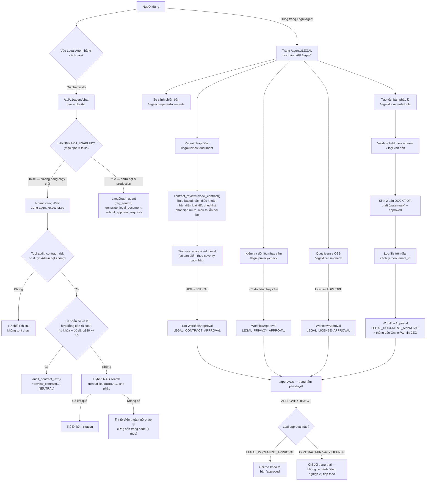

# Báo cáo: Tính năng và luồng hoạt động của Legal Agent

**Ngày:** 2026-09-05
**Phạm vi:** Toàn bộ các tính năng của Legal Agent — cả luồng chat (`/api/v1/agent/chat`) lẫn bộ API nghiệp vụ riêng (`/api/v1/legal/*`) mà trang **Legal Agent** trên frontend đang dùng.
**Mã nguồn liên quan:**
- [agent_executor.py](../backend/app/services/agents/agent_executor.py) — nhánh xử lý chat cho role `LEGAL`
- [specialized.py](../backend/app/api/v1/specialized.py) — toàn bộ API `/legal/*`
- [contract_review/analyzer.py](../backend/app/services/contract_review/analyzer.py), [clause_parser.py](../backend/app/services/contract_review/clause_parser.py), [schemas.py](../backend/app/services/contract_review/schemas.py) — bộ máy rà soát hợp đồng
- [legal_service.py](../backend/app/services/legal_service.py) — dò dữ liệu nhạy cảm, so sánh phiên bản, quét license
- [legal_documents/](../backend/app/services/legal_documents/) — schema + template 7 loại văn bản
- [legal_document_generator.py](../backend/app/services/legal_document_generator.py), [legal_draft_storage.py](../backend/app/services/legal_draft_storage.py) — sinh file DOCX/PDF và lưu trữ có cách ly theo tenant
- [approvals.py](../backend/app/api/v1/approvals.py) — vòng phê duyệt dùng chung
- [app/agents/LEGAL/page.tsx](../frontend/app/agents/LEGAL/page.tsx), [LegalDocumentGeneratorModal.tsx](../frontend/components/legal/LegalDocumentGeneratorModal.tsx) — giao diện

---

## 1. Tóm tắt một câu

Legal Agent thực chất là **hai hệ thống tách rời**: một nhánh **chat đơn giản, dò từ khóa** trong `agent_executor.py`, và một **bộ API nghiệp vụ độc lập** (`/legal/*`) chứa toàn bộ giá trị thật — rà soát hợp đồng theo rule pack xác định, sinh văn bản pháp lý từ 7 mẫu chuẩn, và một vòng phê duyệt Owner/Admin/CEO bắt buộc trước khi tải file cuối. Trang Legal Agent trên frontend gần như không gọi chat để làm nghiệp vụ — nó gọi thẳng các API `/legal/*` này.

---

## 2. Sơ đồ tổng thể

---

## 3. Hai luồng tách biệt — vì sao cần phân biệt

### 3.1. Luồng Chat (`/api/v1/agent/chat`, role `LEGAL`)

Đây là nhánh **đơn giản nhất** trong toàn bộ agent_executor.py so với các agent khác (HR có bộ định tuyến ý định hai tầng LLM + keyword rất phức tạp — xem [[hr-agent-routing-architecture]]). Với Legal, logic chỉ có 3 bước, không có bước phân loại ý định (intent classification) riêng, không có LLM router:

1. **Kiểm tra quyền công cụ** — nếu Admin chưa bật `audit_contract_risk` cho agent này, Legal Agent **từ chối rà soát** ngay cả khi người dùng dán nguyên hợp đồng vào, chỉ trả lời lịch sự rằng công cụ chưa được bật.
2. **Đoán xem tin nhắn có phải là hợp đồng cần rà soát không**, bằng cách dò từ khóa (`hợp đồng`, `contract`, `nda`, `msa`, `clause`...) kết hợp với từ khóa rủi ro (`rủi ro`, `penalty`, `unlimited liability`...) **hoặc** đơn giản là tin nhắn dài ≥ 180 ký tự. Nếu khớp → gọi `audit_contract_text()`, tức là chạy đúng bộ máy rà soát rule-based ở mục 3.3, nhưng **luôn cố định góc nhìn `NEUTRAL`** (không hỏi người dùng đang đại diện bên nào).
3. Nếu không giống hợp đồng → thử **tìm kiếm RAG lai (hybrid search)** trên tài liệu nội bộ mà người dùng được phép xem theo ACL; nếu vẫn không có kết quả → tra một **từ điển thuật ngữ pháp lý cứng trong code** chỉ có 4 mục (`indemnification`, `bồi thường`, `force majeure`, `intellectual property`). Ngoài 4 từ này, Legal Agent trả lời "chưa tìm thấy văn bản phù hợp" thay vì tự suy diễn.

→ Luồng chat phù hợp để **hỏi nhanh** hoặc dán một đoạn hợp đồng ngắn, nhưng **không phải là nơi thực hiện nghiệp vụ chính** (không so sánh phiên bản, không kiểm tra dữ liệu nhạy cảm, không sinh văn bản được).

### 3.2. Luồng API nghiệp vụ (`/api/v1/legal/*`) — nơi trang Legal Agent thực sự chạy

Trang `/agents/LEGAL` trên frontend **không dùng chat để làm nghiệp vụ**. Mỗi nút bấm (Contract Review, NDA Checker, Clause Comparison, Privacy Checker, OSS & License, Contract Generator) gọi thẳng một endpoint REST riêng, upload file (PDF/DOCX/TXT/CSV/XLSX/JSON, tối đa 10MB), và nhận về kết quả có cấu trúc đầy đủ (không qua LLM tổng hợp câu trả lời). Đây là 5 tính năng chính:

| Tính năng | Endpoint | Input | Output chính |
|---|---|---|---|
| Rà soát hợp đồng | `POST /legal/review-document` | 1 file + góc nhìn (Bên A / Bên B / Neutral) | Risk score, danh sách finding có bằng chứng, checklist theo loại HĐ, đề xuất sửa (redline) |
| So sánh 2 phiên bản | `POST /legal/compare-documents` | 2 file (V1, V2) | % tương đồng, danh sách dòng thêm/xóa/sửa theo kiểu diff |
| Kiểm tra dữ liệu nhạy cảm | `POST /legal/privacy-check` | 1 file | Có PII không (email, SĐT, CCCD, hộ chiếu, IP...), có cần Legal duyệt không, khung pháp lý áp dụng (PDPL) |
| Quét license OSS | `POST /legal/license-check` | 1 file manifest (package.json, requirements.txt...) | Danh sách dependency + license (MIT/Apache/GPL/AGPL...), cảnh báo license lan truyền (reciprocal) |
| Tạo văn bản pháp lý | `POST /legal/document-drafts` | Loại văn bản + các field theo schema | File DOCX/PDF bản nháp + bản đã duyệt, tạo sẵn (chờ approval) |

Chỉ endpoint **rà soát hợp đồng** mới truy xuất thêm ngữ cảnh nội bộ qua RAG (`_retrieve_contract_review_references`) để gắn các mẫu/chính sách công ty làm nguồn tham chiếu — nếu tenant chưa có tài liệu pháp lý được index, phần này im lặng bỏ qua (không báo lỗi), rà soát vẫn chạy bằng rule pack nội bộ.

### 3.3. Bộ máy rà soát hợp đồng (`contract_review`) — trái tim của Legal Agent

Đây là phần được đầu tư kỹ nhất, hoàn toàn **rule-based / deterministic**, không dùng LLM để tự luận:

1. **Tách điều khoản** (`split_contract_clauses`) — nhận diện "Điều 1", "Article 2", tiêu đề viết hoa... thành từng clause có số, tiêu đề, nội dung. Nếu tài liệu không có cấu trúc điều khoản rõ, hệ thống tự tách theo đoạn văn.
2. **Nhận diện loại hợp đồng** (`detect_contract_type`) — chấm điểm theo các pattern đặc trưng cho từng loại (SOFTWARE_DEVELOPMENT, SERVICE_AGREEMENT, FREELANCER, NDA, EMPLOYMENT...), loại nào điểm cao nhất thắng; nếu không loại nào khớp, mặc định là `SERVICE_AGREEMENT`. Kèm theo một `confidence` (độ tin cậy) tính từ khoảng cách điểm với loại đứng thứ 2.
3. **Trích metadata** — tên hợp đồng, Bên A/B (kèm cảnh báo nếu vai trò trong tài liệu bị đảo ngược so với quy ước hệ thống: Bên A = Công ty, Bên B = Khách hàng), ngày tháng, số tiền, điều khoản thanh toán, thời hạn.
4. **Rà soát checklist theo loại hợp đồng** — mỗi loại có một danh sách điều khoản bắt buộc phải có (ví dụ Software Development phải có: SOW, phạm vi kỹ thuật, milestone, IP/mã nguồn, bảo hành...); thiếu điều khoản nào → tự tạo một finding "MISSING_CLAUSE" kèm mức nghiêm trọng định sẵn.
5. **Rà soát điều khoản trọng yếu bằng regex** — phát hiện các mẫu rủi ro cụ thể: phạt vi phạm > 8% giá trị hợp đồng, trách nhiệm không giới hạn (unlimited liability), chuyển toàn bộ IP/mã nguồn mà không tách background IP, bảo mật vô thời hạn, quyền chấm dứt đơn phương không có bồi hoàn. Mỗi rule này **đổi mức độ nghiêm trọng theo góc nhìn đã chọn** — cùng một điều khoản "trách nhiệm không giới hạn" sẽ là HIGH nếu bên được đại diện phải gánh, nhưng chỉ là LOW nếu đối tác phải gánh.
6. **Rà soát mâu thuẫn nội bộ** — ví dụ điều 5 nói thanh toán trong 30 ngày, điều 12 lại nói 45 ngày; hoặc tổng % các đợt thanh toán không cộng đủ 100%.
7. **Tính điểm rủi ro** — cộng điểm theo trọng số severity (CRITICAL +35, HIGH +22, MEDIUM +10, LOW +4), nhưng có **sàn điểm** theo finding nghiêm trọng nhất (có 1 HIGH thì điểm tối thiểu là 70) để tránh việc nhiều finding nhỏ cộng dồn che lấp một vấn đề lớn duy nhất; nhãn CRITICAL chỉ gắn khi có ít nhất 1 finding tự nó là CRITICAL.
8. Mỗi finding đều có: bằng chứng trích từ văn bản gốc, lý do, khuyến nghị, **đề xuất câu chữ thay thế (suggested_revision)**, và nguồn tham chiếu (luật/nghị định hoặc "mẫu chuẩn nội bộ" nếu không có nguồn luật cụ thể).

### 3.4. Sinh văn bản pháp lý + vòng phê duyệt bắt buộc

Có **7 loại văn bản** được hỗ trợ với schema field đầy đủ (NDA, Hợp đồng lao động, Hợp đồng Freelancer, Thỏa thuận thực tập, Hợp đồng dịch vụ, Hợp đồng phát triển phần mềm, Hợp đồng bảo trì). Quy trình:

1. Người dùng chọn loại văn bản trên modal → điền form theo schema (field bắt buộc/tùy chọn, có validate và cảnh báo trước khi submit qua `/legal/validate-document`).
2. Khi submit (`POST /legal/document-drafts`), backend sinh **cùng lúc 2 file**: một bản **"DRAFT"** có watermark cảnh báo (`DỰ THẢO — CẦN PHÊ DUYỆT PHÁP LÝ`) và một bản **"APPROVED"** không watermark, cả hai lưu trên đĩa với đường dẫn cách ly theo `tenant_id` (có chống path-traversal ở `legal_draft_storage.py`).
3. Tạo một `WorkflowApproval` loại `LEGAL_DOCUMENT_APPROVAL` và gửi thông báo tới **tất cả Owner/Admin/CEO** của tenant.
4. **Trước khi được duyệt:** người tạo chỉ xem/tải được bản DRAFT (có watermark); Owner/Admin/CEO thì xem được cả hai bản.
5. **Sau khi được APPROVE:** người tạo mới được phép tải bản "approved" (không watermark). Bản `EDIT_AND_APPROVE` (sửa nội dung khi duyệt) **bị chặn tuyệt đối** cho loại approval này — chỉ được APPROVE hoặc REJECT nguyên trạng, không cho sửa payload khi duyệt.

### 3.5. Kết quả rà soát/kiểm tra dữ liệu nhạy cảm/license cũng tạo approval — nhưng chỉ để lưu vết

Khi `review-document`, `privacy-check`, hoặc `license-check` phát hiện rủi ro cao (`requires_legal_approval = true`), hệ thống tự tạo một `WorkflowApproval` tương ứng (`LEGAL_CONTRACT_APPROVAL` / `LEGAL_PRIVACY_APPROVAL` / `LEGAL_LICENSE_APPROVAL`) và hiện lên Trung tâm phê duyệt. Khác với `LEGAL_DOCUMENT_APPROVAL`, ba loại approval này **không gắn với bất kỳ hành động nghiệp vụ tiếp theo nào** trong `approvals.py` — Approve hay Reject chỉ đổi trạng thái bản ghi (giống một chữ ký xác nhận "đã xem, đã biết rủi ro"), không có gì bị khoá hay mở khoá thêm như bên document-draft. Người dùng cuối cần được giải thích rõ: đây là **bước ghi nhận/thông báo**, không phải cổng chặn hành động như quy trình xin nghỉ phép của HR.

---

## 4. Những điểm cần lưu ý (rủi ro vận hành, không phải lỗi code nghiêm trọng)

1. **Nút Accept / Reject / Edit trên từng finding (trang rà soát hợp đồng) chỉ là state cục bộ trong trình duyệt** — `ContractReviewResult` ở [page.tsx](../frontend/app/agents/LEGAL/page.tsx) lưu quyết định vào `useState`, không có lệnh gọi API nào gửi quyết định này lên server. Nghĩa là: nếu người rà soát bấm Accept/Reject/sửa câu chữ rồi refresh trang hoặc rời đi, **toàn bộ quyết định biến mất**, và hệ thống không có bản ghi nào về việc ai đã chấp nhận/từ chối điều khoản nào. Đây thuần là công cụ hỗ trợ đọc, chưa phải workflow redline có lưu vết.
2. **`GET /legal/download-redline/{file_id}` trả về nội dung giả lập cố định** ("SIMULATED REDLINE DOCX FILE FOR..."), không sinh file thật từ kết quả rà soát. Đường dẫn này được tạo ra trong `audit_contract_text()` (dùng ở nhánh chat) nhưng chưa được nối vào bộ sinh văn bản thật.
3. **Góc nhìn (Bên A/B/Neutral) không nhất quán giữa 2 lối vào**: dán hợp đồng qua chat luôn rà soát ở góc nhìn `NEUTRAL` cố định, còn upload file qua trang Legal Agent thì bắt buộc chọn góc nhìn. Vì mức độ nghiêm trọng của nhiều finding phụ thuộc vào góc nhìn (mục 3.3, bước 5), **cùng một hợp đồng có thể ra risk score khác nhau tuỳ vào việc người dùng dán vào chat hay upload file**.
4. **Ngưỡng nhận diện "đây là hợp đồng cần rà soát" trong chat khá thô** (từ khóa + độ dài ≥ 180 ký tự). Một hợp đồng ngắn hoặc không chứa đúng từ khóa rủi ro có thể bị rơi vào nhánh RAG/từ điển thuật ngữ thay vì được audit — người dùng sẽ không biết là hợp đồng của họ chưa từng được rà soát thật.
5. **Công tắc `LANGGRAPH_ENABLED`** (mặc định `false` toàn hệ thống) là một điểm rẽ nhánh ẩn giống hệt phát hiện đã ghi ở [[hr-agent-routing-architecture]]: nếu ai đó bật cờ này, Legal Agent trong chat sẽ **bỏ hoàn toàn bộ máy rule-based** (checklist theo loại hợp đồng, phát hiện rủi ro theo regex, phát hiện mâu thuẫn nội bộ) và chuyển sang một agent LLM tool-calling đơn giản hơn nhiều chỉ có 3 tool (`rag_search`, `generate_legal_document`, `submit_approval_request`) — không có tool rà soát rủi ro nào tương đương. Cần đảm bảo ai bật cờ này trong tương lai biết hậu quả đó.

---

## 4b. Cập nhật 2026-09-05: đã vá toàn bộ 5 điểm trên (+1 điểm phát hiện thêm)

Sau khi báo cáo được duyệt, cả 5 vấn đề ở mục 4 đã được sửa, cộng thêm một vấn đề thứ 6 phát hiện trong quá trình lên phương án:

| # | Vấn đề | Cách vá |
|---|---|---|
| 1 | Quyết định redline không được lưu | Thêm 2 bảng `contract_reviews` + `contract_review_decisions` (migration `r31e6a8b2c40`). Mỗi finding nay có `finding_key` sinh từ nội dung (hash) nên không đổi khi chạy lại, thay cho `finding-N` theo vị trí. Frontend gọi `PUT /legal/contract-reviews/{id}/decisions/{finding_key}` (optimistic, rollback khi lỗi). Upload lại đúng file cũ sẽ mở lại chính bản rà soát đó kèm quyết định. |
| 2 | Stub redline không xác thực | Xóa `GET /legal/download-redline/{file_id}`. Thay bằng `GET /legal/contract-reviews/{id}/redline` có xác thực + ACL, sinh file **DOCX thật** (nguyên văn gạch đỏ / đề xuất gạch chân, phụ lục finding chưa xử lý và toàn văn điều khoản). Trả 409 nếu chưa có đề xuất nào được chấp nhận; đổi quyết định là xóa cache file cũ. |
| 3 | Góc nhìn không nhất quán | Chat **hỏi bạn đại diện bên nào** trước khi rà soát, hiểu được "bên A", "mình là bên bán", "khách hàng", "trung lập"; hủy được bằng "hủy". Nội dung hợp đồng lấy lại theo hash nội dung nên không bao giờ rà nhầm văn bản khác. |
| 4 | Ngưỡng nhận diện thô | Bỏ hẳn `len >= 180`. Thay bằng bộ chấm điểm dùng chính parser điều khoản thật; khi không chắc thì **hỏi lại** thay vì im lặng rơi vào RAG. Mọi câu trả lời không-rà-soát nay kèm dòng "tôi chưa rà soát rủi ro nội dung này". |
| 5 | Công tắc ẩn LangGraph | Cảnh báo ở startup + comment tại `DOMAIN_POLICIES["LEGAL"]` + 3 test chốt chặn (default phải là false, fallback phải chạy, warning phải xuất hiện). |
| 6 | *(mới)* Chat không tạo phiếu phê duyệt | Chat nay tạo `WorkflowApproval` giống hệt luồng upload khi rủi ro HIGH/CRITICAL. |

Kèm theo: 21 test mới (4 file), trong đó có các test hồi quy trực tiếp cho từng lỗi — ví dụ redline không đăng nhập phải trả 401, và cùng một hợp đồng trả lời Bên A vs Bên B phải ra mức nghiêm trọng khác nhau.

---

## 5. Tổng kết

Legal Agent mạnh nhất ở **rà soát hợp đồng theo rule pack có thể giải thích được** (mỗi finding đều trích dẫn được bằng chứng và nguồn) và ở **quy trình sinh văn bản có kiểm soát phê duyệt chặt** (2 bản draft/approved, khoá tải cho tới khi duyệt). Điểm yếu chính nằm ở nhánh chat (khá sơ sài so với engine thật) và ở việc thiếu một bước lưu vết quyết định redline của người rà soát.
