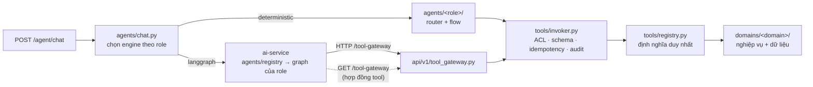
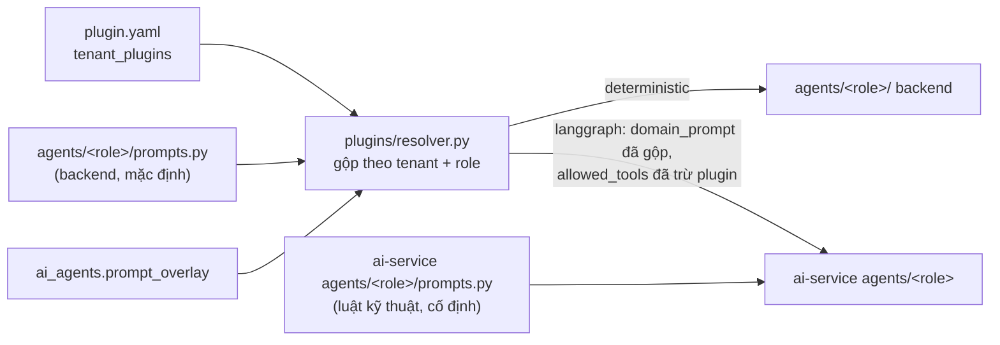

# Kế hoạch refactor: gom nghiệp vụ agent về gateway tool, dọn cấu trúc backend và ai-service

Ngày lập: 2026-09-24. Trạng thái: **đã chốt, chưa thực hiện**. Các quyết định nằm ở mục 2; cấu trúc ở mục 4 đã được duyệt ngày 2026-09-24.

## 1. Hiện trạng (số liệu đo trên nhánh `legal-agent-langgraph-fixes`)

### 1.1 `agent_executor.py` gánh mọi thứ
[`backend/app/services/agents/agent_executor.py`](../backend/app/services/agents/agent_executor.py) dài 2.775 dòng. File này gánh cả hiểu ý định, hỏi lại, slot filling, kiểm quyền, gọi nghiệp vụ, dựng card lẫn câu trả lời.

| Nhánh | Kích thước | Ghi chú |
|---|---|---|
| HR | ~1.600 dòng (helper ở dòng 95–1027, nhánh ở 1659–2335) | 17 intent, 14 capability, slot filling đơn nghỉ phép |
| Legal | ~740 dòng (1028–1468, 2406–2700) | Router LLM, hỏi bên đại diện, rà soát, trả lời bám tài liệu |
| Knowledge | ~70 dòng | Hybrid RAG |
| IT, Finance, Sales, CEO | ~20 dòng mỗi nhánh | Gọi service **mock** (xem 1.3) |

### 1.2 Ba hệ thống tên quyền, hai bản hợp đồng tool
- **Capability** (`DEFAULT_AGENT_CAPABILITIES` trong `auth_service.py`) do `agent_executor` kiểm: HR 14, Legal 6, IT 2, Finance/Sales/CEO/Knowledge mỗi role 1.
- **Gateway tool** (8 tool trong `backend/app/tools/registry.py`) do `/tool-gateway` kiểm, cấp theo `GATEWAY_TOOL_GRANTS`.
- **Domain policy** (`apps/ai-service/app/orchestration/subgraphs.py`) liệt kê lại danh sách tool cho từng domain.
- Riêng tìm kiếm tri thức có 3 tên: `rag_search`, `hybrid_rag_search`, `hybrid_search_documents`.
- Schema và registry tool bị **viết hai lần**, ở `backend/app/tools/{schemas,registry}.py` và `apps/ai-service/app/tools/{schemas,registry}.py`, với cùng danh sách class. Backend đã có `GET /api/v1/tool-gateway` trả hợp đồng tool, nhưng ai-service không dùng.
- Kiểm quyền tool nằm ở hai nơi: `_require_tool`/`_can_use_tool` trong `agent_executor` và `_agent_permits` trong `tool_gateway`. Ngoài ra, các file khác còn import hàm private của `agent_executor`.

### 1.3 IT, Finance, Sales, CEO là mock
| Agent | Service | Hành vi thực tế |
|---|---|---|
| IT | `it_service.handle_it_request` | Có chữ "wifi" thì trả **mật khẩu Wi-Fi viết cứng trong code**. Mọi tin khác sinh "Jira ticket" với key ngẫu nhiên, không gọi Jira. |
| Finance | `finance_service.audit_invoice_and_reconcile` | `discrepancy = True` cố định, PO kỳ vọng cố định 12.000.000đ, nên luôn báo lệch. |
| Sales | `sales_service.handle_sales_request` | Luôn báo giá "Camera AI IP Security 4K" 2.500.000đ; `pdf_url` trỏ tới đường dẫn không tồn tại. |
| CEO | `ceo_service.generate_and_execute_ceo_dag` | Luôn trả 4 bước onboarding ở trạng thái COMPLETED ("Đã tạo email… và kích hoạt VPN"), dù **không việc nào thực sự được làm**. |

### 1.4 Code chết trong ai-service
Các phần dưới đây không được gọi ở đâu, ngoài test của chính chúng:
- `POST /v1/agents/route` cùng `app/agents/*` (5 agent stub, mỗi file 8 dòng, có cả role không tồn tại ở backend), `chains/structured_extraction.py`, `schemas/routing.py`, `schemas/findings.py`, `select_langchain_runtime`, `LANGCHAIN_ENABLED`, `LANGCHAIN_AGENT_ROLES`. Backend không gọi `route_agent`.
- `chains/rag_answer.py` (chỉ có test gọi), `app/memory/` (stub), `app/tools/{calendar,database,document,email,web}/` (chỉ có `__init__.py` rỗng).
- `app/rag/retrieval/`, `app/rag/generation/` là stub; retrieval thật nằm ở backend. `app/rag/ingestion/{loaders,parser.py,pipeline.py}` cũng không ai dùng, vì backend tự parse tài liệu.

### 1.5 Hai bộ LLM song song trong ai-service
- `app/llm/` (`LLMRouter`, xoay vòng nhiều key) phục vụ `/v1/llm/generate`.
- `app/models/factory.py` (LangChain, **chỉ dùng 1 key**) phục vụ graph.

Hai bộ này chọn provider và key theo logic khác nhau. Lỗi "graph bỏ qua `LLM_DEFAULT_PROVIDER`" sửa ngày 2026-09-24 sinh ra từ chính sự trùng lặp này.

### 1.6 Cấu trúc thư mục
- `backend/app/services/` là một thư mục phẳng 57 file, khoảng 15.000 dòng.
- `apps/ai-service/app/main.py` dài 607 dòng, gom mọi route cùng phần dựng runtime graph.
- Graph bị chia ở 3 nơi: `orchestration/engine.py` chứa node dùng chung lẫn graph cha, `subgraphs.py` chứa policy từng domain, còn `main.py` dựng runtime.
- **Repo đang track 6.896 file của `apps/ai-service/.venv`**.
- Ở gốc `backend/` có file lạc: `demo_manual_test.py`, `test_embed.py`, `seed_test_company.py`.

## 2. Quyết định đã chốt (2026-09-24)
| # | Câu hỏi | Quyết định | Hệ quả trong kế hoạch |
|---|---|---|---|
| 1 | IT, Finance, Sales, CEO (mock) | **Gỡ khỏi chat nhưng giữ code** để phát triển sau | Chat trả lời "đang phát triển" và không gọi service. Code chuyển vào khu "đang phát triển", tách khỏi luồng chạy. Xem P0. |
| 2 | HR có chuyển sang LangGraph không | **Chưa chuyển; sau này chuyển hết sang LangGraph** | HR tiếp tục chạy deterministic. Tool HR phải thiết kế an toàn để graph gọi được ngay (quyền tính ở server). Đích cuối: mọi role chạy LangGraph. |
| 3 | Đổi tên tool kèm migration | **Có** | P2 gộp 3 tên tìm kiếm và viết migration Alembic kèm alias. |
| 4 | Nhịp PR | **Gom lại** | Một nhánh, một PR. Bên trong chia commit theo giai đoạn để review được. |
| 5 | 4 agent đang phát triển trên frontend | **Vẫn hiện, gắn nhãn "Under development"** | Thẻ agent và trang chat hiện nhãn; ô nhập bị khoá kèm lời giải thích. Backend vẫn chặn độc lập (xem P0). |

## 3. Mục tiêu và nguyên tắc
1. **Mỗi tool có đúng một định nghĩa**, đặt trong registry của backend: tên, schema, loại hành động, ACL, hàm thực thi, card. Chat thường và LangGraph gọi cùng một hàm, qua cùng một cổng kiểm quyền, audit và idempotency.
2. **Dữ liệu và quyền nằm ở backend.** ai-service không truy cập DB nghiệp vụ; nó chỉ gọi tool qua gateway (có JWT, ACL, audit).
3. **Tầng điều phối không chứa nghiệp vụ.** Hiểu ý định, hỏi lại và slot filling ở tầng agent; tính toán và đọc/ghi dữ liệu nằm trong tool.
4. **Quyền tính ở server** từ actor và agent, không bao giờ lấy từ tham số do model điền.
5. **Chuyển engine theo từng role**, có số liệu eval trước khi chuyển.
6. **Test xanh sau mỗi commit.** Commit di chuyển file tách riêng khỏi commit đổi logic. Không tạo file hay thư mục rỗng "để dành".

## 4. Kiến trúc đích



### 4.1 Backend
```
backend/app/
  api/v1/                 # chỉ HTTP: xác thực, parse, gọi agents/ hoặc domains/
  agents/                 # điều phối chat (thay cho services/agents/)
    chat.py               # execute_agent_chat: chọn engine theo role; role đang phát triển → trả lời cố định
    response.py           # dựng ChatResponse, map card từ kết quả tool
    llm_json.py  prompt_registry.py
    hr/        router.py  flows/leave.py  flows/directory.py  replies.py  prompts.py
    legal/     router.py  review_flow.py  answer.py  replies.py  prompts.py
    knowledge/ flow.py
    langgraph/ engine.py  approvals.py
  tools/
    registry.py  invoker.py  permissions.py
    hr/ legal/ knowledge/ tasks.py approvals.py
  domains/                # nghiệp vụ, không biết gì về chat hay LLM
    hr/  legal/  knowledge/  platform/
    incubating/           # IT, Finance, Sales, CEO: giữ để phát triển, KHÔNG nối vào chat hay tool
      README.md           # nói rõ đây là mock và việc cần làm để thành thật
      it_service.py  finance_service.py  sales_service.py  ceo_service.py
  clients/ai_service_client.py
  core/ models/ schemas/ plugins/ db/ main.py worker.py
backend/scripts/          # seed_test_company.py và các script thủ công
```

### 4.2 ai-service: cấu trúc mới theo mẫu đã đưa

```
apps/ai-service/
├── app/
│   ├── main.py                      # chỉ tạo FastAPI, gắn router, lifespan (checkpointer, model memory)
│   │
│   ├── api/
│   │   ├── dependencies.py          # require_internal_token, đọc tool JWT      ← main.py
│   │   └── routes/
│   │       ├── health.py            # /health, /health/runtime, /health/accelerator
│   │       ├── orchestration.py     # /v1/orchestration/run|stream|resume  (≈ chat.py của mẫu)
│   │       ├── rag.py               # /v1/rag/chunk(+/stream), /v1/rag/rerank, /v1/embeddings,
│   │       │                        # /v1/token-count, /v1/pipeline/events
│   │       └── llm.py               # /v1/llm/generate
│   │
│   ├── agents/
│   │   ├── base/                    # phần mọi agent dùng chung
│   │   │   ├── state.py             # WorkforceAgentState                         ← orchestration/state.py
│   │   │   ├── policy.py            # DomainPolicy + node policy/tool_scope       ← orchestration/subgraphs.py
│   │   │   ├── nodes.py             # retrieve_context, model_decision, execute_tool, approval_interrupt,
│   │   │   │                        # output_validation, citation_verification  ← orchestration/engine.py
│   │   │   ├── graph.py             # build_agent_graph(policy): khung chuẩn input_guard → retrieve →
│   │   │   │                        # model ⇄ tool/approval → output_validation → citation_verification
│   │   │   ├── decision.py          # LangChainDecisionProvider, DeterministicDecisionProvider
│   │   │   ├── runtime.py           # OrchestrationRuntimeContext + dựng runtime mỗi lượt ← main.py
│   │   │   └── persistence.py       # checkpointer memory/postgres                ← orchestration/persistence.py
│   │   ├── registry.py              # role → graph đã compile (alias IT/Sales → customer_support);
│   │   │                            # role lạ → lỗi 422, không đoán; invoke/stream/resume theo role
│   │   ├── hr/          agent.py  graph.py  prompts.py  tools.py
│   │   ├── legal/       agent.py  graph.py  prompts.py  tools.py
│   │   ├── knowledge/   agent.py  graph.py  prompts.py  tools.py     # "rag" trong mẫu
│   │   ├── finance/     agent.py  prompts.py  tools.py               # đang phát triển, backend chưa route tới
│   │   ├── customer_support/ agent.py  prompts.py  tools.py          # đang phát triển (IT, Sales)
│   │   └── ceo/         agent.py  prompts.py  tools.py               # đang phát triển; sau này là agent
│   │                                                                 # điều phối, gọi agent khác như tool
│   │
│   ├── core/
│   │   ├── config.py                # ← app/config.py
│   │   ├── security.py              # xác thực token nội bộ và tool JWT
│   │   ├── database.py              # URL và kết nối Postgres cho checkpoint
│   │   ├── aws.py                   # ← aws_clients.py
│   │   ├── model_memory.py          # ← model_memory.py
│   │   └── llm/                     # MỘT bộ LLM: gộp app/llm/* với models/factory.py
│   │       ├── providers.py         # openai, gemini, bedrock, local
│   │       ├── router.py            # chọn provider, xoay vòng key, fallback
│   │       └── factory.py           # chat model LangChain cho graph, dùng chung router ở trên
│   │
│   ├── governance/                  # (không có trong mẫu) hàng rào an toàn cho agent
│   │   ├── guardrails.py            # input_guard, output_guard, pii_filter, tool_permission (gộp 4 file nhỏ)
│   │   └── middleware/              # context, model_selection, observability, output_validation,
│   │                                # redaction, stack, tenant_acl
│   │
│   ├── services/                    # năng lực không phải agent, phục vụ backend qua /v1/rag, /v1/llm
│   │   ├── chunking/                # chunker.py, cleaner.py            ← rag/ingestion
│   │   ├── embedding/               # base, factory, deterministic, gemini, huggingface, openai ← rag/embedding
│   │   ├── reranking/               # base, factory, bge, jina, lexical, reranker, score_fusion ← rag/reranking
│   │   ├── generation.py            # generate_chat cho /v1/llm/generate ← chains/chat.py
│   │   └── pipeline_events.py       # ← pipeline_events.py
│   │
│   ├── tools/
│   │   ├── gateway.py               # HTTP client tới backend /tool-gateway
│   │   └── registry.py              # dựng LangChain tool từ hợp đồng backend trả về (không tự khai báo)
│   │
│   └── schemas/
│       ├── orchestration.py         # ← shared/contracts.py (phần orchestration)
│       ├── rag.py                   # chunk, embeddings, rerank, token-count
│       ├── llm.py                   # generate
│       └── citations.py
│
├── evaluation/                      # giữ nguyên; thêm metrics.py      ← app/rag/evaluation
├── tests/
│   ├── conftest.py
│   ├── agents/        test_graph.py (← phase5), test_citations.py (← output_guardrails),
│   │                  test_persistence.py (← phase6)
│   ├── tools/         test_registry.py (← tool_registry_phase3)
│   ├── governance/    test_middleware.py (← middleware_phase4)
│   ├── core/          test_llm.py (← langchain_phase2 + provider_key_fallback)
│   ├── services/      test_embedding.py, test_reranking.py, test_chunking.py (← test_service, gemini, jina)
│   └── integration/   test_api.py (← phần endpoint của test_service), test_baseline.py
├── Dockerfile  pyproject.toml  README.md  .env.example
```

**Vai trò từng file trong một thư mục agent** (ví dụ `agents/legal/`):
- `agent.py`: `POLICY = DomainPolicy(...)`, gồm tên domain, trần tool và các node riêng nếu có.
- `graph.py`: `build_graph()` gọi `build_agent_graph(POLICY)`, rồi nối thêm node riêng khi agent cần. Ví dụ sau này Legal có bước hỏi bên đại diện.
- `prompts.py`: prompt mặc định của domain. Prompt do tenant tuỳ biến vẫn đến từ backend qua payload.
- `tools.py`: **trần tool** của domain, tức danh sách tên tool backend mà agent này được phép thấy, kèm gợi ý cách dùng cho model. Không chứa code thực thi.
- `state.py` chỉ tạo khi agent cần thêm field vào state. Hiện chưa agent nào cần, nên chỉ có `agents/base/state.py`.

**Bản đồ file cũ sang file mới**

| Hiện tại | Chuyển tới |
|---|---|
| `main.py` (607 dòng) | `main.py` (chỉ tạo app) + `api/routes/*` + `api/dependencies.py` + `agents/base/runtime.py` |
| `config.py`, `aws_clients.py`, `model_memory.py` | `core/` |
| `orchestration/engine.py` | `agents/base/nodes.py` + `agents/base/graph.py` + `agents/registry.py`; bỏ `intent_router`, `agent_selector` |
| `orchestration/subgraphs.py` | `agents/base/policy.py` + `agents/<role>/agent.py` |
| `orchestration/{state,decision,persistence}.py` | `agents/base/` |
| `llm/*` + `models/factory.py` | `core/llm/` |
| `middleware/*` + `guardrails/*` | `governance/` |
| `rag/embedding`, `rag/reranking` | `services/embedding`, `services/reranking` |
| `rag/ingestion/{chunker,cleaner}.py` | `services/chunking/` |
| `rag/evaluation/*` | `evaluation/metrics.py` |
| `chains/chat.py`, `pipeline_events.py` | `services/` |
| `shared/contracts.py`, `schemas/citations.py` | `schemas/` |
| `tools/gateway.py`, `tools/registry.py` | giữ ở `tools/`; bỏ `tools/schemas.py` sau P1 |
| `feature_flags.runtime_feature_snapshot` | gộp vào `api/routes/health.py` |

**Xoá hẳn** (code chết, xem 1.4): `agents/*` cũ, `chains/structured_extraction.py`, `chains/rag_answer.py`, `schemas/{routing,findings}.py`, `memory/`, `tools/{calendar,database,document,email,web}/`, `rag/retrieval/`, `rag/generation/`, `rag/ingestion/{loaders,parser.py,pipeline.py}`, `llm/usage_tracker.py` (nếu xác nhận không ai dùng), route `/v1/agents/route`, cùng các biến `LANGCHAIN_ENABLED` và `LANGCHAIN_AGENT_ROLES`.

**Điểm lệch so với mẫu, có lý do:**
1. **Không có `services/employee_service.py`, `permission_service.py` hay `core/database.py` cho dữ liệu nghiệp vụ.** Dữ liệu và quyền thuộc backend. Nếu ai-service tự đọc DB nhân sự thì quyền HR sẽ được kiểm ở hai nơi, đúng loại lỗi mà đợt rà soát phân quyền đã sửa. `core/database.py` ở đây chỉ phục vụ checkpoint của LangGraph.
2. **`agents/<role>/tools.py` là một file khai báo, không phải thư mục code tool.** Tool được thực thi ở backend, và hợp đồng của nó do backend cấp (P1). Nếu viết lại tool trong ai-service thì lại có hai bản như hiện nay.
3. **Không có thư mục `prompts/` ở gốc.** Dockerfile chỉ copy `app/`, nên prompt ở gốc sẽ không có trong image. Repo cũng đã xoá `app/prompts/` một lần vì prompt đặt ở đó không bao giờ được nạp. Prompt mặc định nằm trong `agents/<role>/prompts.py`; prompt tuỳ biến theo tenant đi qua hệ thống plugin của backend.
4. **Không tạo sẵn `utils/`, `tools/common/` (web_search, calculator) hay `tests/agents/…` rỗng.** Thư mục chỉ xuất hiện khi có code thật. Log và tracing hiện nằm ở `governance/middleware/observability.py`.
5. **Thêm `governance/`** cho middleware và guardrails. Mẫu không có chỗ cho phần này, nhưng đây là lớp an toàn quan trọng nhất của graph.
6. **Đổi tên `rag/` thành `knowledge/`** để khớp mã role `KNOWLEDGE` của backend, tránh phải ánh xạ tên.
7. Giữ `pyproject.toml`, không thêm `requirements.txt`.
8. **Không có `manager/` (graph cha).** Người dùng luôn chat với một agent cụ thể, và backend luôn gửi `requested_agent`, nên `intent_router` và `agent_selector` hiện chỉ chuyền giá trị. Luật keyword bên trong chúng chưa từng chạy thật, và nếu role lạ thì chúng đoán sang agent khác một cách im lặng. Mỗi agent có graph riêng, còn `agents/registry.py` chọn graph theo role. Phối hợp nhiều agent sau này là việc của agent CEO: nó gọi agent khác như tool bên trong graph của mình, không đứng chắn trước mọi cuộc chat.

### 4.3 Prompt plugin của từng công ty

**Nguyên tắc:** backend là nơi duy nhất lưu và gộp tuỳ biến của tenant. ai-service không lưu prompt nào của tenant.

| Thành phần | Hiện tại | Sau refactor |
|---|---|---|
| Gói dựng sẵn (YAML, đổi qua release) | `backend/plugins/<gói>/plugin.yaml` | giữ nguyên |
| Gói tenant tự soạn, bản ghi cài | bảng `tenant_plugins`, `tenant_plugin_installs`; API `api/v1/plugins.py`; CLI `app/plugins/cli.py` | giữ nguyên |
| Gộp prompt (append/replace) và thu hẹp tool | `backend/app/plugins/resolver.py` | giữ nguyên; vẫn là nơi **duy nhất** làm việc này |
| Prompt mặc định của các slot tenant được sửa | `services/agents/hr_prompts.py`, `legal_prompts.py`, `prompt_registry.py` | `app/agents/hr/prompts.py`, `app/agents/legal/prompts.py`, `app/agents/knowledge/prompts.py` (slot mới `knowledge_answer`), `app/agents/prompt_registry.py` |
| Overlay theo agent | cột `ai_agents.prompt_overlay`, nối vào slot trả lời | giữ nguyên |
| Prompt kỹ thuật của graph (định dạng JSON, luật gọi tool, an toàn) | `orchestration/decision.py`, `subgraphs.py` | `ai-service/app/agents/base/decision.py`, `agents/<role>/prompts.py`; tenant **không** sửa được |

**Luồng khi chạy LangGraph:**


- Backend gộp xong mới gửi **văn bản cuối** trong `domain_prompt`. Vì vậy trang xem trước plugin hiển thị đúng thứ model sẽ nhận, không cần gọi sang ai-service.
- Cùng một slot áp dụng cho cả hai engine. Ví dụ gói `company-a-hr` sửa slot `answer` (xưng "anh/chị"): quy ước này vẫn đúng khi HR chuyển sang LangGraph, và tenant không phải viết lại gói.
- ai-service đặt luật kỹ thuật **sau** phần của tenant và trong một khối riêng. Tenant đổi được giọng văn, nhưng không gỡ được luật an toàn hay luật gọi tool.
- Slot chỉ có ở luồng deterministic (`classifier`, `legal_classifier`, `legal_perspective`) được đánh dấu `engines: [deterministic]`. Khi role chạy LangGraph, trang plugin ghi rõ các slot đó "không áp dụng", thay vì im lặng bỏ qua.
- Việc còn mở khi chuyển hết sang LangGraph: gợi ý định tuyến mà tenant đang viết trong slot `classifier` (ví dụ "kỳ review là câu hỏi chính sách") cần một slot tương đương trong graph. Việc này tính khi chuyển từng role, không thuộc PR này.

**Hai lỗi hiện có sẽ sửa trong P1:**
1. Khi chạy LangGraph, backend không gửi prompt plugin sang ai-service, nên mọi tuỳ biến prompt của tenant bị bỏ qua.
2. `allowed_tools` gửi sang graph chưa trừ phần plugin đã thu hẹp. Gateway vẫn chặn đúng (trả 403), nhưng model vẫn thấy những tool đó và mất một vòng gọi vô ích.

## 5. Các giai đoạn (một nhánh, một PR; mỗi giai đoạn là một hoặc vài commit)

### P0: Dọn nền và gỡ 4 agent mock khỏi chat
- Gỡ `apps/ai-service/.venv` khỏi git, thêm vào `.gitignore`.
- Chat với IT, Finance, Sales, CEO trả câu cố định "Agent này đang được phát triển" và không gọi service. Trang cấu hình các agent này vẫn còn.
- Frontend: 4 agent này vẫn hiện trong danh sách, kèm nhãn **"Under development"**; trang chat khoá ô nhập và giải thích lý do. Backend trả cờ `under_development` trong dữ liệu agent để frontend không phải tự viết cứng danh sách.
- Chuyển 4 service sang `backend/app/domains/incubating/` kèm `README.md`. Xoá mật khẩu Wi-Fi viết cứng. Bỏ trạng thái COMPLETED giả trong dữ liệu mẫu của CEO, thay bằng `PLANNED`.
- Chuyển `seed_test_company.py` sang `backend/scripts/`; xoá `demo_manual_test.py` và `test_embed.py`.
- Xong khi: test xanh; không đường chat nào gọi được 4 service kia.

### P1: Một nguồn hợp đồng tool
- Tách phần thân của `POST /tool-gateway/{name}/invoke` thành `tools/invoker.py`, dùng chung cho chat.
- `GET /tool-gateway` trả thêm `terminal` và loại card. ai-service dựng tool từ hợp đồng này (có cache TTL), rồi xoá `apps/ai-service/app/tools/schemas.py`. Nếu không tải được hợp đồng thì chạy không có tool và báo lỗi rõ.
- Backend gộp prompt qua `plugins/resolver.py` rồi gửi văn bản cuối trong `domain_prompt`. Luật kỹ thuật của ai-service đứng sau phần này, và tenant không sửa được (xem 4.3).
- `allowed_tools` trong payload phải trừ phần plugin đã thu hẹp, để model không thấy tool mà gateway sẽ chặn.
- Thêm thuộc tính `engines` cho slot prompt; trang plugin ghi rõ slot nào không áp dụng khi role chạy LangGraph.

### P2: Hợp nhất tên quyền
- Mỗi capability thành một tool trong registry, khai báo luôn role được dùng. `supported_agent_tools` suy ra từ registry.
- Gộp 3 tên tìm kiếm về `rag_search`. Viết migration Alembic đổi tên trong `ai_agents.tools_access`, `allowed_actions`, `disallowed_actions` và trong manifest plugin; tên cũ vẫn đọc được như alias trong một release.
- Dùng một hàm `tools/permissions.permits()` duy nhất, thay cho `_require_tool`, `_can_use_tool` và `_agent_permits`.

### P3: Chuyển nghiệp vụ sang tool, lần lượt từng domain
1. **Legal**: `compare_contract_versions`, `check_sensitive_data`, `check_software_licenses`, `generate_legal_document`. Các endpoint `/legal/*` gọi qua invoker.
2. **Knowledge**: `rag_search` và bước trả lời có trích dẫn.
3. **HR**: mỗi capability thành một tool chỉ nhận tham số tối thiểu. `hr_access_policy` quyết định section; model không bao giờ chọn `purpose`. `request_leave` là action tool, đi qua phê duyệt. Tool thiết kế để graph gọi được ngay (quyết định 2), dù HR vẫn chạy deterministic. `test_hr_section_matrix` phải khớp 100%.
4. **Card**: tool trả `card: {type, data}`, và `agents/response.py` map card cho cả hai engine. Các field `jira_card`, `invoice_card`… trong API giữ nguyên.

### P4: Tách `agent_executor.py` và dọn backend
- Chuyển sang `agents/{hr,legal,knowledge}/`, giữ nguyên chữ ký `execute_agent_chat` và `stream_hr_chat_events`. Mỗi file không quá khoảng 400 dòng.
- Chuyển các file còn lại trong `services/` sang `domains/`, `clients/` theo mục 4.1, rồi xoá thư mục `services/`.

### P5: Tái cấu trúc ai-service theo mục 4.2
- Commit thứ nhất chỉ di chuyển file và sửa import, không đổi logic; đường dẫn các endpoint giữ nguyên.
- Commit thứ hai xoá code chết và gộp hai bộ LLM (graph được xoay vòng key).
- Commit thứ ba tách `engine.py` thành `agents/base` và `agents/registry.py`, bỏ graph cha, mỗi agent có `agent.py` và `graph.py` riêng. Checkpointer vẫn dùng chung, `thread_id` là id hội thoại; khi resume, graph được chọn theo `agent_role` mà backend đã gửi sẵn.
- Xong khi: backend và ai-service test xanh; backend không phải sửa gì; `uvicorn app.main:app` và Docker build chạy được.

### P6: Chọn engine theo role (chuẩn bị cho việc chuyển hết sang LangGraph sau này)
- Thay cờ toàn cục `LANGGRAPH_ENABLED` bằng `AGENT_ENGINES` theo từng role, mặc định `deterministic`.
- Dựng bộ eval live; mỗi role phải đạt ngưỡng mới được chuyển. Bật Postgres checkpoint khi có role chạy LangGraph ở production.
- Lộ trình về sau: Knowledge → Legal → HR → các agent đang phát triển, khi đã làm thật. Việc chuyển thật sự **không nằm trong PR này**.

### P7: Tài liệu
- Chia `docs/` thành `architecture/`, `plans/`, `reports/`, `manuals/`.
- Cập nhật `BACKEND_FLOW.md`, `AI_SERVICE_ARCHITECTURE.md`, `07-tool-calling.md` và README của ai-service theo cấu trúc mới.

## 6. Thứ tự làm trong PR
```
P0 → P5 (ai-service, độc lập với backend) → P1 → P2 → P3 Legal → P3 Knowledge → P3 HR → P4 → P6 → P7
```
Làm P5 sớm, vì P1 sẽ viết `tools/registry.py` mới của ai-service ngay tại vị trí đích, khỏi phải chuyển file hai lần.

## 7. Rủi ro và cách giảm
| Rủi ro | Cách giảm |
|---|---|
| PR gom lại rất lớn, khó review | Commit theo giai đoạn, commit di chuyển tách khỏi commit logic; mỗi commit đều chạy đủ test (xuất code bằng `git archive` như đã làm ngày 2026-09-24) |
| Quyền HR bị lỏng khi chuyển sang tool | `test_hr_section_matrix` là cổng chặn; tool HR không nhận tham số quyết định quyền |
| Đổi tên tool làm hỏng cấu hình tenant hoặc plugin | Migration dữ liệu + alias một release + test đọc cấu hình cũ |
| ai-service phụ thuộc backend để lấy hợp đồng tool | Cache TTL; nếu lỗi thì chạy không tool và báo rõ |
| Import vòng khi tách file | Chiều phụ thuộc cố định: backend `agents → tools → domains`; ai-service `api → agents → governance/core`, `services` không import `agents` |
| Người dùng bất ngờ khi 4 agent ngừng trả lời | Câu trả lời cố định nói rõ agent đang phát triển; ghi vào change report |

## 8. Còn cần xác nhận
1. ~~Các điểm lệch so với cấu trúc mẫu~~ → đã duyệt ngày 2026-09-24.
2. ~~Ẩn hay hiện 4 agent đang phát triển trên frontend~~ → đã chốt: hiện kèm nhãn "Under development" (quyết định 5).
