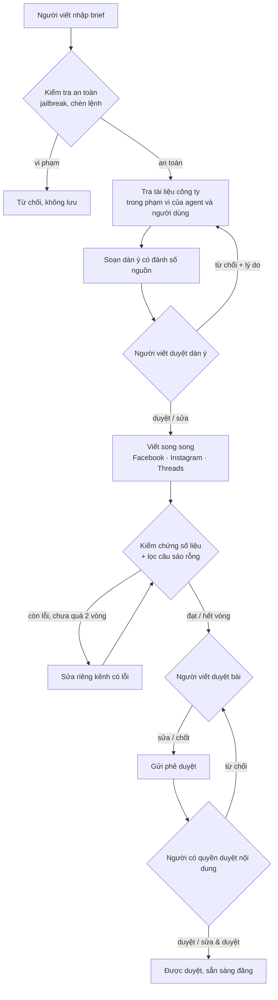

# Báo cáo tích hợp Marketing Agent — 09/10/2026

## 1. Tóm tắt

Marketing Agent được chuyển từ dự án độc lập `market-agent` sang AI-workforce. Người dùng nhập brief chiến dịch, trợ lý soạn kế hoạch và bài đăng, và người dùng duyệt ở hai bước:

1. **Dàn ý chiến dịch**, soạn từ brief và tài liệu công ty. Người viết duyệt, sửa trực tiếp, hoặc từ chối kèm lý do để trợ lý soạn lại.
2. **Ba bài đăng** Facebook, Instagram và Threads, viết song song. Trợ lý tự kiểm chứng số liệu với nguồn và tự sửa tối đa 2 vòng. Người viết đối chiếu báo cáo kiểm chứng, sửa từng kênh nếu cần, rồi chốt.

Bài đã chốt được gửi tới **Trung tâm phê duyệt**. Người có quyền "Duyệt nội dung truyền thông" duyệt, sửa rồi duyệt, hoặc từ chối. Người gửi không được tự duyệt bài của mình. Hệ thống không tự đăng bài ở đâu cả.

Phần đăng nhập, kho tài liệu (RAG), bảng giá model và trang chi phí của bản gốc **không mang sang**, vì AI-workforce đã có sẵn và có phân quyền chặt hơn.

## 2. Luồng hoạt động

Có hai cách bắt đầu một chiến dịch:
- Từ trang **Trợ lý Marketing → Chiến dịch mới**. Mỗi bước hiện tiến trình theo thời gian thực.
- Trong **chat**, ví dụ "lập chiến dịch cho …". Trợ lý soạn dàn ý từ đúng tin nhắn của người dùng, rồi trả link để mở chiến dịch và duyệt.

Ngoài ra, chat trả lời câu hỏi kiến thức marketing từ tài liệu công ty, có ghi nguồn. Nếu tài liệu không có nội dung đó, trợ lý nói rõ là không có, không tự suy diễn.

## 3. Kiểm soát và an toàn

| Lớp | Cách làm |
|---|---|
| Đầu vào | Lọc câu cố tình điều khiển AI (tiếng Việt và tiếng Anh), kể cả thẻ giả mạo. Áp dụng cho brief, nội dung người dùng sửa, và lý do từ chối. |
| Thông tin cá nhân | Số điện thoại, email, tên người (khi có danh xưng) được thay bằng mã như [SĐT_1] trước khi gửi cho nhà cung cấp AI, rồi điền lại trong kết quả. |
| Tài liệu tham chiếu | Tài liệu được bọc riêng; AI được dặn chỉ coi là dữ liệu, không làm theo lệnh nằm trong tài liệu. |
| Chống bịa số | Khâu kiểm chứng đối chiếu mọi số liệu, giá, ưu đãi, tên khách hàng với brief, dàn ý và tài liệu. Câu sáo rỗng kiểu AI cũng bị đưa vào vòng sửa. |
| Đầu ra | Khoá API, mật khẩu, token lọt vào bài viết đều bị che. |
| Lưu trữ | Brief, dàn ý và bài viết được mã hoá trong cơ sở dữ liệu. |
| Phân quyền | 3 quyền mới, tick theo chức vụ (xem mục 4). Mỗi người chỉ thấy chiến dịch của mình, trừ người có quyền xem tất cả. |
| Chi phí | Mỗi lần gọi AI được ghi vào trang Quản lý Chi phí AI, dưới tên agent MARKETING. |

## 4. Quyền theo chức vụ

| Quyền | Mặc định cấp cho |
|---|---|
| Lập chiến dịch truyền thông | Mọi chức vụ, trừ Khách |
| Duyệt nội dung truyền thông | Các chức vụ có quyền ký duyệt (Quản lý trở lên) |
| Xem mọi chiến dịch | CEO, Quản trị viên |

Quản trị viên có thể bỏ tick các quyền này ở trang Cơ cấu chức vụ.

## 5. Kết quả chạy thử với AI thật (Gemini)

| Bước | Thời gian | Kết quả |
|---|---|---|
| Brief → dàn ý | ~11 giây | Dàn ý 8 mục, có trích nguồn [brief] và tài liệu [2], [6] |
| Từ chối kèm góp ý | ~9 giây | Dàn ý mới bám theo góp ý |
| Duyệt → viết 3 bài + kiểm chứng | ~15 giây | Kiểm chứng bắt lỗi 2 lần, tự sửa đúng kênh có lỗi, lần thứ 3 đạt |
| Sửa tay bài Threads → chốt → gửi duyệt | tức thì | Phiếu duyệt ghi rõ bài nào đã sửa sau kiểm chứng; 6 người đủ quyền duyệt |
| Người gửi tự duyệt | — | Bị chặn |
| Quản lý duyệt | — | Chiến dịch chuyển sang "Đã được duyệt" |
| Chat: "lập chiến dịch khoá học Excel…" | ~30 giây | Tạo chiến dịch và trả link mở chiến dịch |
| Chat: câu hỏi về mô hình RFM, Hệ thống 1/2 | — | Trả lời đúng, có nguồn tới đúng mục tài liệu |

Hotline có trong brief được che khi gửi cho AI, và vẫn xuất hiện đúng trong bài viết. Dữ liệu chạy thử đã được dọn khỏi cơ sở dữ liệu.

## 6. Tài liệu kiến thức

Tài liệu "Kiến Thức Marketing Chuyên Nghiệp" đã được nạp vào Kho tri thức, collection "Marketing" (48 đoạn), và trợ lý Marketing được giới hạn chỉ đọc collection này. Muốn trợ lý viết sát sản phẩm hơn, cần nạp thêm tài liệu sản phẩm, bảng giá, chính sách ưu đãi và case study của công ty vào cùng collection.

## 7. Hạn chế và việc nên làm tiếp

- Mới có 3 kênh Facebook, Instagram và Threads. Muốn thêm LinkedIn, TikTok hay email thì cần bổ sung quy tắc viết riêng cho từng kênh.
- Chưa đăng bài thẳng lên mạng xã hội; người dùng sao chép bài đã duyệt để đăng.
- Chưa có lịch đăng bài hay đo hiệu quả sau khi đăng.
- Câu hỏi marketing mà tài liệu không có thì trợ lý không trả lời, đúng nguyên tắc chung của hệ thống. Cần nạp thêm tài liệu nếu muốn trả lời rộng hơn.
- Khi triển khai môi trường thật phải chạy `alembic upgrade head` (migration `b2c3d4e5f6a8`).
